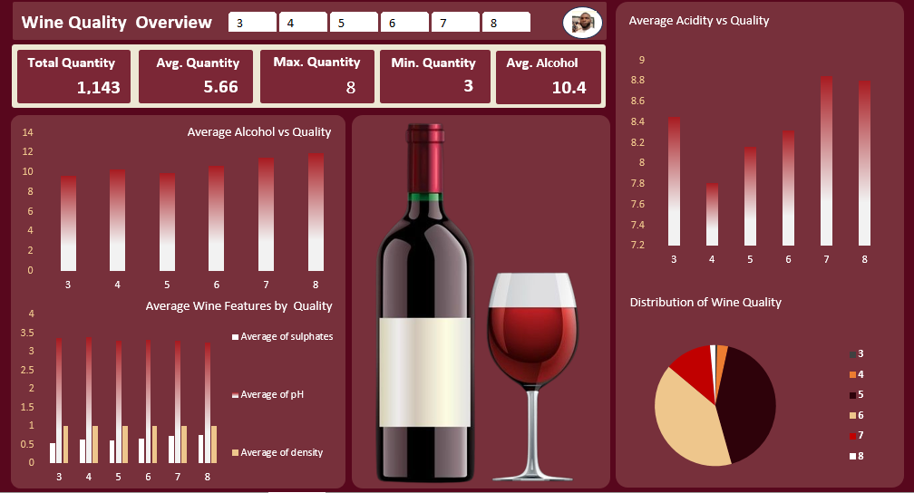

OIBSIP_DataAnalytics_Task2  Wine Quality dataset

Wine Quality Prediction Analysis

- This project focuses on analyzing wine quality based on its chemical characteristics.The goal is to explore how features like alcohol content, acidity, pH, density, and sulphates affect wine quality and the implementation uses Excel and PivotTables to perform a comprehensive data analysis and create an interactive dashboard.  

Project Steps
1. Data Cleaning  
- Removed unnecessary columns (Id)  
- Checked for missing or invalid values  
- Ensured all chemical features are numeric  

2. Exploratory Data Analysis (EDA)  
- Calculated distribution of wine quality  
- Computed averages of key chemical features  
- Identified patterns and relationships between wine quality and chemical properties  

3. KPI Calculation  
- Total number of wines  
- Average, highest, and lowest wine quality  
- Average Alcohol, pH, and Sulphates  

4. PivotTables & Charts  
- Distribution of Wine Quality  
- Average Alcohol vs Quality   
- Average Acidity vs Quality 
- Average Wine Composition by Quality   

5. Interactive Dashboard  
- Added slicers for Quality 
- Connected all PivotTables to slicers for dynamic filtering  
- Organized KPIs and charts into a professional, readable layout  

6. Insights  
- Higher alcohol levels generally correspond to higher wine quality  
- Lower volatile acidity is associated with better quality  
- Sulphates and pH also influence wine quality trends  

Tools Used  
- Microsoft Excel (PivotTables, Charts, Slicers)  

Outcome  
- A fully interactive dashboard that allows users to explore how chemical characteristics affect wine quality.

